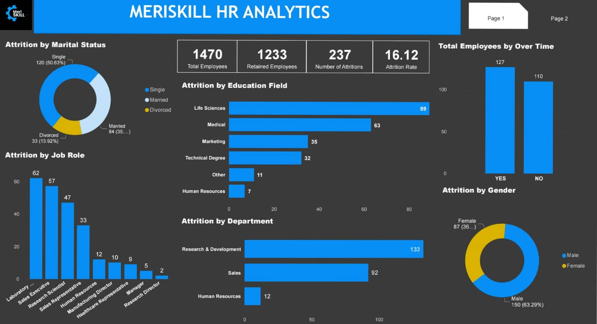
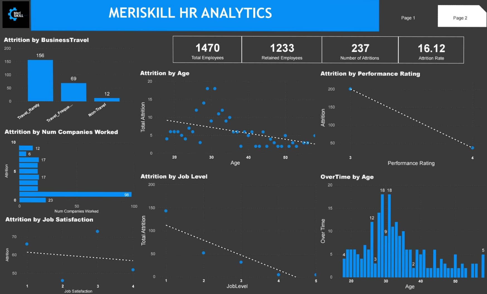

# HR EMPLOYEE ATTRITION PROJECT

The HR Employee Attrition Analysis delves into the factors influencing employee turnover, retention rate within the company, providing valuable insights to enhance retention strategies and promotes a healthier workplace environment.
## DESCRIPTION
The dataset used in this analysis was obtained from MeriSKILL during my internship. The dataset contained 35 columns and 1470 rows. I worked with SQL for detailed analysis and manipulation, followed by Exploratory Data Analysis and PowerBi for visualizations
## KPIs. 
1. Total Number of Employees: 1470
2. Total Attritions: 237
3. Total Retained Employees: 1233
4. Attrition Rate: 16.12%
## INSIGHTS AND RECOMMENDATIONS 
  1.	Looking at the Total Attritions, Marital Status had a huge effect at Attritions. A little over 50% were singles, having the highest count of the 3 categories.

  2.	From Job Role, Laboratory Technicians had the highest number of employees leaving. 

  3.	Laboratory Technicians and Research Scientists were among the roles of employees who left the company the most. By Department, Research and Development lost about 133 employees           out of the 237 Attritions. It is necessary to look into workers satisfaction from the department to determine how well its workers are being treated.

  4.	From this analysis, male employees left the company the most by Gender. 150 male employees left their jobs out of the total 237 Attritions.

  5.	Judging by Business Travel, over half of the employees who left rarely travelled. 156 of the total Attritions travelled rarely. This may be a huge factor as to why employees left         the come company.

  6.	Almost half of the employee who left exhibited low Job Satisfaction. Regular surveys should be taken within the company to understand an employee feeling about his/her job.

  7.	Further analysis showed that the 41% of the Departing employees have only worked at 1 company. Going deeper with my analysis, it showed that 143 of the 237 total Attritions were         at level 1 (Entry Level) according to their Job Level

  8.	Further analysis showed that employee between the age of 26 and 33 worked Over Time the most. According to Attrition by Age, employees between the age of 26 and 35 parted ways           with the company.

    

 

## YOU CAN INTERACT WITH THE DASHBOARD HERE: https://app.powerbi.com/groups/me/reports/7e062aa4-6431-4234-b9b5-b619e0397291/ReportSection?experience=power-bi 

## CONCLUSION.
 
 In the rearms of business, an insightful HR Analysis offers a profound glimpse into the heartbeat of the organization. Through this analysis, we have been able to uncover critical pattens and trends shaping the Rate of Attrition, giving rise to these key takeaways:
  •	Employee welfare should be taken very seriously. Regular surveys should be done, regular feedback and evaluation from employees should 
  
  •	Cultivating Employee Experience. From this Analysis, we found out that most employees who left have either worked in the company for less than a year or were working in an entry         level role before their departure. 
  
  •	Developments and Growth Opportunities. Skills developments programs and opportunities to enhance certain aspect of employee’s professional careers. Regular trainings should be           organised and to those who deserves it, expense paid trips should be considered.   
  
  •	Healthy Work-Life Balance. Promoting a healthy work-life balance is very essential to employee retainment. Reasonable work hours, flexible schedule, remote work option and reduced       over time hours to avoid a culture of overworking and burnout. 
  
  •	Exit Interview Analysis. Conducting thorough exit interviews to understand and determine the reason behind employee departures. This feedback/analysis could be used to identify exit   pattern and take notice of areas that need improvement. 
  
### By Implementing these strategies and fostering a supporting, engaging work environment, Attrition Rate could be significantly reduced ensuring a stable, motivated and loyal workforce that contributes to long-term success.
